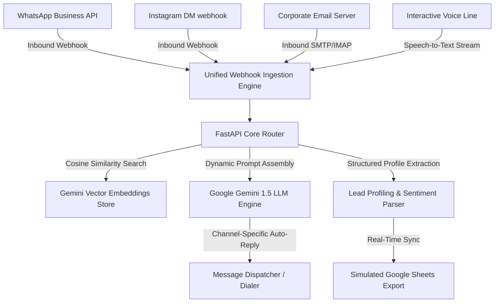

<div align="center">

# MCAR Platform 🚀
### Multi-Channel Auto Reply & AI-Powered Conversational Automation Engine

[](https://mcar-platform.vercel.app/)
[](https://dashboard.render.com)
[](https://python.org)
[](https://ai.google.dev/)

**MCAR (Multi-Channel Auto Reply)** is an enterprise-grade conversational middleware and unified inbox architecture designed to automate client communications across **WhatsApp**, **Instagram**, **Email**, and **Voice Lines**. Powered by **Google Gemini 1.5**, it features dynamic RAG vector lookups, automated lead profiling, sentiment analysis, and seamless backend synchronizations.

[Explore Platform](https://mcar-platform.vercel.app/) • [View Blueprint](render.yaml) • [Report Bug](https://github.com/MadhuChitikela/mcar-platform/issues)

</div>

---

> [!WARNING]
> ### 📢 Upcoming Infrastructure Maintenance Notice
> We will be upgrading critical routing infrastructure on **May 27th, 6:30 am GMT+5:30** (May 27th, 1:00 am UTC). Please follow our status dashboard for real-time recovery progress.

---

## 📐 System Architecture

The following diagram illustrates how inbound customer messages across all channels are ingested, processed through the Gemini RAG pipeline, auto-replied, and synchronized to structured datastores:



---

## 🛠️ Premium Product Capabilities

* **Unified Inbox & Channel Mapping:** Merges multiple channels into one responsive grid, visually displaying routing details:  
  `WhatsApp • Customer: +91 98765 43210 ➔ Business: +91 98765 43210`.
* **Frosted Credentials Setup Dialog:** An aesthetic, glassmorphic settings modal allowing business owners to bind and persist their corporate handles in `localStorage` and the backend memory state.
* **Speech-to-Text Voice Overlay:** Fully interactive Voice Call overlay mimicking a real calling line with speech recognition, dynamic visual audio waveforms, and text-to-speech AI playback.
* **Smart RAG Vector Context:** Direct document (PDF/TXT) chunking and cosine similarity matching, allowing Gemini to respond with high domain accuracy (e.g. customized tax audits, bookkeeping fees, and GST filing queries).
* **Live Operational Metrics:** Doughnut and bar charts powered by **Chart.js** displaying real-time lead conversion score, AI automation rate, and sentiment distribution.

---

## ⚙️ Core API Specifications

| Endpoint | Method | Payload | Description |
| :--- | :--- | :--- | :--- |
| `/api/conversations` | `GET` | *None* | Retrieves all active client chat threads. |
| `/api/owner-settings` | `POST` | `OwnerSettingsRequest` | Syncs custom business credentials to memory state. |
| `/api/simulate` | `POST` | `SimulateMessageRequest` | Simulates an inbound event across a target channel. |
| `/api/upload-rag` | `POST` | `RagUploadRequest` | Adds custom text blocks into the RAG index. |
| `/api/upload-file` | `POST` | `Multipart/Form-Data` | Uploads and vector-chunks a PDF knowledge base. |
| `/api/stats` | `GET` | *None* | Computes sentiment, conversion, and channel stats. |

---

## 💻 Local Developer Setup

### Prerequisites
* Python 3.10 or higher
* Active Google Gemini API Key (stored in `.env`)

### Installation & Launch

1. **Clone and Navigate:**
   ```bash
   git clone https://github.com/MadhuChitikela/mcar-platform.git
   cd mcar-platform
   ```

2. **Initialize Virtual Environment:**
   ```bash
   python -m venv venv
   # Activate:
   # On Windows:
   .\venv\Scripts\activate
   # On macOS/Linux:
   source venv/bin/activate
   ```

3. **Install Core Requirements:**
   ```bash
   pip install -r requirements.txt
   ```

4. **Boot Up Development Server:**
   ```bash
   python main.py
   ```
   Access the dashboard at **[http://127.0.0.1:8000](http://127.0.0.1:8000)**.

---

## ⚡ Zero-Configuration Cloud Deployment

### A. Deploy to Vercel (Hobby Free Tier)
This repository is optimized for serverless Python deploys on **Vercel** with zero cold starts:
1. Log in to [Vercel](https://vercel.com/dashboard) and click **Add New Project**.
2. Import this repository. Keep the Preset as **Other** (Vercel will parse `vercel.json` automatically).
3. Under **Environment Variables**, add `GEMINI_API_KEY`.
4. Click **Deploy**!

### B. Deploy to Render (Web Service Free Tier)
We have bundled a pre-configured `render.yaml` Blueprint:
1. Log in to [Render](https://dashboard.render.com/) and select **New + -> Blueprint**.
2. Connect this repository. Render will automatically extract build/start scripts and prompt you for the `GEMINI_API_KEY`.
3. Click **Apply**.
